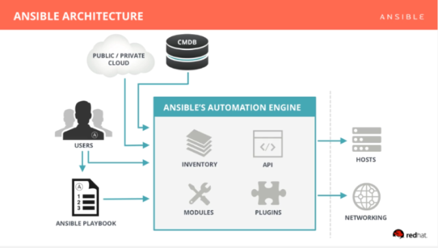

= Lab 1: Ansible Overview

== Overview of Ansible

Ansible is an open source automation platform that can manage hosts over
the `ssh` protocol. Ansible is described in three words: Simple, Powerful, Agentless.
It is considered simple due to providing human-readable automation. The playbooks
are written using http://docs.ansible.com/ansible/latest/reference_appendices/YAMLSyntax.html[YAML syntax]
that requires no coding skills and each task within the playbook is executed in
order. Ansible is considered powerful because of its flexibility to automate
your entire app lifecycle. Ansible is agentless thus doesn't require installing
anything on the managed remote hosts. It uses OpenSSH or WinRM to run tasks and
execute Ansible modules on the managed hosts.

== Ansible Architecture

The Ansible architecture consists of two types of machines labeled: _Control Machine_
and _Managed Nodes_. Ansible is installed on the control machine. The control
machine contains all of the playbooks that are to be run against your managed
nodes. The managed nodes are listed in an _inventory_ file. The inventory
of the managed hosts is either a simple static text file or a dynamic inventory
file created by a set of scripts written by the end user to determine the IPs or the
hostname of the hosts that are to be managed. For the purposes of this lab, we will
use a dynamic inventory script to retrieve information about our OpenStack instances.
Ansible inventories include the ability to group nodes together for easier manageability.
For example grouping all the database nodes in a group labelled database. The OpenStack
dynamic inventory script retrieves group membership from the instance's metadata.

After Ansible takes the input of the nodes to be managed, a _playbook_ that contains
at least one play is executed for the managed nodes that are selected. A play
executes a series of tasks in order on the managed nodes. Each task runs a
specific Ansible module that is specified within your Ansible playbook. The tasks
are what may change the state of the managed hosts as they may install packages
on a system, modify files, and/or change configuration settings. For the
purposes of this lab, the main focus will be on using OpenStack Ansible modules
to manage our OpenStack instances.

A pictorial representation of Ansible's architecture from the Ansible site can
be seen below:

[.text-center]
.Ansible Architecture

{nbsp} +

In this lab environment, our control machine is our OVH instance. This instance
we will use Ansible playbooks to configure OpenStack instances, create our
database backup and provide the ability to restore our database using the
playbooks that will be created in the upcoming labs. 

The OVH instance should already come with Ansible installed. Confirmation
of the installation of Ansible can be done via:

----
$ ansible --version
----

////
The subsequent sections go into the installation of Ansible and their
prerequisites.

== Installation of Prerequisite Tools

In order to use Ansible playbooks against our OpenStack environment, we must
first install the required prerequisites. Your workstation requires the following
to be installed (if not already):

* https://www.ansible.com/[Ansible]
* https://git-scm.com/[Git]
* Text editor (such as https://www.sublimetext.com/3[Sublime Text])

NOTE: The Fedora VirtualBox image pre-installs all the required prerequisites.
Please reference the section <<vbsetup, VirtualBox Setup>> if not planning on
using your local laptop/workstation. The install instructions for the different
OS vendors may be skipped if using the VirtualBox image.

== macOS Install Instructions

=== Installing Ansible (Method #1)

The preferred way to install Ansible on the macOS is via the Python package
manager `pip`. Launch a terminal and execute the following commands:

.Installation of `pip`
----
sudo easy_install pip
----

.Installation of Ansible via `pip`
----
sudo pip install ansible
----

Verify that Ansible is successfully installed by running:

----
ansible --version
----

The expected output is similar to the following:

----
$ ansible 2.5.0
  config file = /etc/ansible/ansible.cfg
  configured module search path = [u'/home/rlopez/.ansible/plugins/modules', u'/usr/share/ansible/plugins/modules']
  ansible python module location = /usr/lib/python2.7/site-packages/ansible
  executable location = /usr/bin/ansible
  python version = 2.7.14 (default, Feb 27 2018, 20:43:24) [GCC 7.3.1 20180130 (Red Hat 7.3.1-2)]

----

=== Installing Ansible (Method #2)

A second method of deploying Ansible for the macOS, is using https://brew.sh[Homebrew].
Launch a terminal and execute the following commands:

.Installation of `brew`
----
brew install ansible
----

Verify that Ansible is successfully installed by running:

----
ansible --version
----

The expected output is similar to the following:

----
$ ansible 2.5.0
  config file = /etc/ansible/ansible.cfg
  configured module search path = [u'/home/rlopez/.ansible/plugins/modules', u'/usr/share/ansible/plugins/modules']
  ansible python module location = /usr/lib/python2.7/site-packages/ansible
  executable location = /usr/bin/ansible
  python version = 2.7.14 (default, Feb 27 2018, 20:43:24) [GCC 7.3.1 20180130 (Red Hat 7.3.1-2)]

----

=== Installing Git in macOS

Within the macOS, `git` is installed with the Xcode Command Line Tools. Prior
to installation of `git`, verify if `git` is already installed within the macOS
as follows via a terminal:

[source]
----
git --version
----

If `git` is not installed, a version of `git` could be downloaded and installed
https://git-scm.com/download/mac[here].

=== Installing text editor (Sublime Text) on macOS

In this lab, we will use a Sublime Text to write the ansible playbooks. To install Sublime Text download the latest version at: https://www.sublimetext.com/3 .

== Microsoft Windows Install Instructions

=== Installing Ansible and Git in Windows

Ansible in Microsoft Windows could be installed using http://cygwin.com[Cygwin].
Installation instructions on how to install Cygwin are located
at: http://cygwin.com/install.html .

The following list of packages are required during the Cygwin installation:

* `curl`
* `python (2.7.x)`
* `python-jinja`
* `python-crypto`
* `python-openssl`
* `python-setuptools`
* `git (1.7.x)`
* `vim`
* `openssh`
* `openssl`
* `openssl-devel`
* `gcc-g++`
* `libffi-devel`
* `libmysqlclient-devel`

After this install `PyYAML` and `Jinja2` separately, as they are not
available in Cygwin.

Once installed, open Cygwin to complete the installation of Ansible.

.Generate a SSH key
----
ssh-keygen -t rsa
----

.Install `pip`
----
easy_install-2.7 pip
----

.Install Ansible
----
pip install ansible
----

==== Installing a Text editor on Windows

In this lab we will use a Sublime Text to write the ansible playbooks. To install Sublime Text download the latest version for Microsoft Windows at: https://www.sublimetext.com/3 .

== Linux Install Instructions

The following subsections provide steps to install Ansible and `git` for
the following Linux distributions:

* Fedora
* Red Hat Enterprise Linux (RHEL)
* CentOS
* Ubuntu

=== Fedora - Ansible & Git Installation Instructions

The preferred method to install Ansible and `git` on Fedora is using the
`dnf` package manager.

As a `sudo` user,

.Install Ansible and Git
----
sudo dnf -y install ansible git
----

=== RHEL - Ansible & Git Installation Instructions

The preferred method to install Ansible and `git` on RHEL is using the
`yum` package manager.

As a `sudo` user, perform the following steps.

.Enable the following repositories
----
sudo subscription-manager repos --enable=rhel-7-server-rpms --enable=rhel-7-server-ansible-2-rpms
----

As a `sudo` user, install the following packages

.Install Ansible and Git
----
sudo yum -y install ansible git
----

=== CentOS - Ansible & Git Installation Instructions

The preferred method to install Ansible and `git` on CentOS is using the
`yum` package manager.

As a `sudo` user,

.Install Ansible and Git
----
sudo yum -y  install ansible git
----

=== Ubuntu - Ansible & Git Installation Instructions

The preferred method to install Ansible and `git` on Ubuntu is using the
`apt-get` command line tool that works with APT software packages.

As a `sudo` user,

.Install Ansible and Git
----
sudo apt-get update
sudo apt-get install software-properties-common
sudo apt-add-repository ppa:ansible/ansible
sudo apt-get update
sudo apt-get install ansible git
----

////

==== Using a text editor

In Linux we will use vi/vim/nano to edit and manipulate files. If using vi/vim,
place the following snippet in your ~/.vimrc of your OVH cloud instance to make
use of the tab key as 2 spaces.

----
autocmd FileType yaml setlocal ts=2 sw=2 et
----
////

[[vbsetup]]
== VirtualBox Setup (Pre-Installed Image)

If installing Ansible and/or `git` on your laptop/workstation is not your
preferred method, a VirtualBox image is provided that may be used as your
workstation to complete the corresponding labs.

Prior to using the provided https://s3.amazonaws.com/ansible-mgmt/ansible-mgmt.ova[Fedora VirtualBox Image],
download and install VirtualBox for your corresponding Operating System. Visit
https://www.virtualbox.org/wiki/Downloads to complete the installation.

Below is a table with the specifics regarding the VirtualBox image.

|====
| *VirtualBox Image Location* | *username* | *password*
| https://s3.amazonaws.com/ansible-mgmt/ansible-mgmt.ova | `ansible` | `ansible`
|====

== Installing Ansible using Vagrant

If interested in running a Fedora workstation using Vagrant, the following steps provide the setup.

The steps below are done on a Fedora machine.

----
# Install Vagrant
dnf install -y vagrant

# Install VirtualBox
dnf install -y VirtualBox

# Create a folder on your system that will store the Vagrantfile to run your VM.
mkdir ~/openstack-vagrant
cd ~/openstack-vagrant

# Initialize the 'box' which creates the Vagrantfile. We will be creating a Fedora 27 box.
vagrant init fedora/27-cloud-base

#Boot the Fedora 27 server using the following command:
vagrant up --provider virtualbox

#SSH into the vagrant box using the vagrant ssh command:
vagrant ssh
----

////
