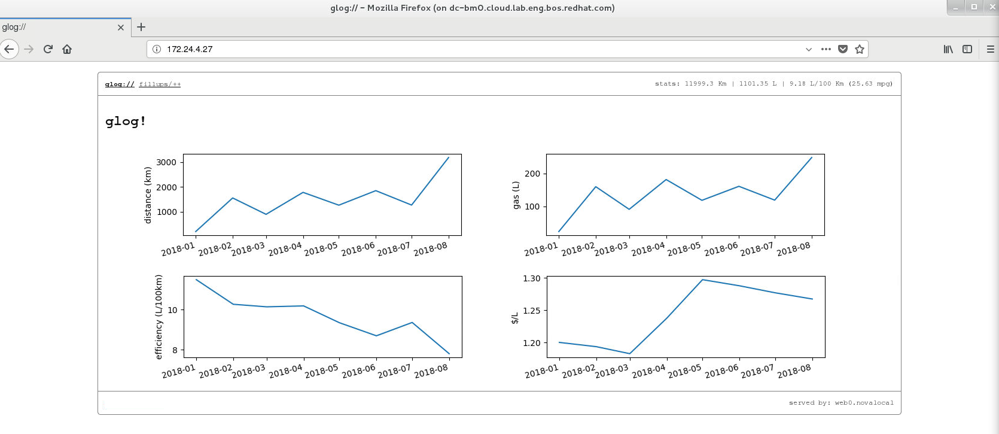

= Lab 3: Introduction to Playbooks

In lab three, we will focus on learning how to create and structure Ansible Playbooks.
After completing this section, you should be able to write basic Ansible playbooks
and use the *ansible-playbook* command. This information will be handy to interact
programmatically against our OpenStack instances in later labs.

== Ansible Playbooks

In [underline]#Lab 2# you learned how to run *ad-hoc* commands with Ansible.
Ad-hoc commands can run a single, simple task. The real power of Ansible is in
how to use playbooks to run multiple, complex tasks against a system or a group
of systems in an easily repeatable way.

There are two central concepts to understand before writing playbooks:

* A **play**: is an ordered set of tasks which should be run against hosts selected from your inventory.

* A **playbook**: is a text file that contains a list of one or more plays to run in order

== Playbook format

To better understand the structure of a playbook, let us first review a simple ad-hoc command:

[source,]
----
$ ansible web,db -m command -a "hostname"
d7c5d271-2aa9-4186-91f1-abdc900554ee | CHANGED | rc=0 >>
web1.novalocal

a103664a-2a9f-4802-8cc0-9afb224050b4 | CHANGED | rc=0 >>
web0.novalocal

331a2613-9b53-4507-a34e-8378782539dd | CHANGED | rc=0 >>
db0.novalocal
----

The previous command should report the hostname of the system or systems used as target.

This can be rewritten as a simple single-task play and saved in a playbook. The resulting playbook might appear as follows:

.single-task-playbook.yml
----
---
- name: Execute raw command to get hostname from system
  hosts: web, db
  tasks:
    - name: Hostname command
      command: hostname
...
----

A *playbook* is a text file written in http://docs.ansible.com/ansible/latest/reference_appendices/YAMLSyntax.html[YAML]
format, and is normally saved with the extension yml. The playbook primarily uses
indentation with space characters to indicate the structure of its data.
YAML doesn't place strict requirements on how many spaces are used for the indentation, but there are two basic rules:

* Data elements at the same level in the hierarchy (such as items in the same list) must have the same indentation.
* Items that are children of another item must be indented more than their parents.
You can also add blank lines for readability.

The playbook begins with a line consisting of three dashes (---) as a start of document marker
and it is a good practice to end each playbook with three dots (...) as an end of document marker.

In between those markers, the playbook is defined as a list of plays. An item in a
YAML list starts with a single dash (-) followed by a space. For example, a YAML list might appear as follows:

[source,]
----
- nova
- glance
- neutron
- cinder
- keystone
- manila
----

The play itself is a collection (an associative array or hash/dictionary) of key: value pairs.
Keys in the same play should have the same indentation. The following example describes a
YAML hash/dictionary with three keys. The first two keys have simple values. The third has a list of three items as a value.

.example.yml
----
---
- name: Example
  hosts: Fileservers
  tasks:
    - one
    - two
    - three
...
----

In the previous example, the play has three keys: name, hosts, and tasks.
These keys all have the same indentation because they belong to the play.
The first line of the example play starts with a dash and a space (indicating
the play is the first item of a list), and then the first key, the name attribute.

NOTE: The order in which the plays and tasks are listed in a playbook is
important, because Ansible runs them in the same order.

////
[source,]
____
*The order in which the plays and tasks are listed in a playbook is important, because
Ansible runs them in the same order.*
____
////

== Running playbooks

Now that we know the structure of a playbook and how easy it is to write one, let's discuss
the `ansible-playbook` command. The `ansible-playbook` command is used to run playbooks
and is executed on the control node. Using the `ansible-playbook` command run the
_single-task-playbook.yml_ from the previous example.

[source,]
----
$ ansible-playbook single-task-playbook.yml
----

After the playbook is executed, output is generated to show the play and tasks.

In general, tasks in Ansible playbooks are idempotent, and it is safe to run the playbook multiple times.
If the targeted managed hosts are already in the correct state, no changes should be made.

=== Verifying the Syntax before running

Before executing a playbook, it is best practice to perform a verification to ensure
that the syntax of its contents is correct. The ansible-playbook command offers a
`--syntax-check` option which can be used to verify the syntax of a playbook file.
It is essential to notice that this will only check the syntax and not if the code
is correct for the intended use. The following example shows the successful
syntax verification of the _single-task-playbook.yml_ playbook.

[source,]
----
$ ansible-playbook --syntax-check single-task-playbook.yml
----

When syntax verification fails, a syntax error is reported.  The following example
shows the failed syntax verification of a playbook:

[source,]
----
[ansible@ansiblehost ~]$ ansible-playbook --syntax-check single-task-playbook.yml
ERROR! Syntax Error while loading YAML.
The error appears to have been in '/data/ansible/single-task-playbook.yml': line 8, column 2, but
may be elsewhere in the file depending on the exact syntax problem.
----

=== Dry runs

Another best practice while executing playbooks is to perform a dry run. Dry runs
are invoked with the `-C` option, which runs Ansible to report the changes that would
have occurred if the playbook was executed, but without making actual changes to the managed hosts.

[source,]
----
$ ansible-playbook -C single-task-playbook.yml
----

== Guided Exercise: Ansible Playbook - Backing up a Database using Cinder

At this point, we know how to write and execute basic playbooks. In this guided
exercise we will create a simple Ansible playbook that takes advantage of the
command module to write an openstack command that will create a backup of the
existing `dbvol` that resides within Cinder.

Create the initial portion of our playbook that defines the name, target
and the task to create the backup:

.cinder_backup.yml
----
---
- name: Backing up the database via the Cinder service
  hosts: localhost
  tasks:
  - name: Create a Cinder Backup of Database Volume
    command: "openstack volume backup create --force --name dbvol_backup dbvol"
...
----

//TODO: Will we create a diff user aside from root or just use root?
//Hardcoded location based on just root user and where the file will be

Verify the syntax of the playbook via:

----
$ ansible-playbook --syntax-check cinder_backup.yml
----

Execute the playbook via the following command:

----
$ ansible-playbook cinder_backup.yml
----

The `dbvol_backup` volume can be verified using the following OpenStack command:

----
$ openstack volume backup list
----

For advanced users, the verification process can be included within the playbook
itself. However, this requires knowledge of certain topics yet to be discussed
such as using the register variable and debug module. For completeness, we've
included an additional task that verifies if the `dbvol_backup` exists.

----
---
- name: Backing up the database via the Cinder service
  hosts: localhost
  tasks:
  - name: Create a Cinder Backup of Database Volume
    command: "openstack volume backup create --force --name dbvol_backup dbvol"
  ## wait for backup to complete
  - name: Run the openstack volume backup list command
    shell: "sleep 45 && openstack volume backup list"
    register: output

  - debug: var=output.stdout_lines
...
----

Prior to re-running this updated playbook, for simplicity, we will delete the
existing `dbvol_backup` manually. The steps are as follows:

----
$ openstack volume backup delete dbvol_backup
----

NOTE: If you notice, the existing Ansible playbook is not very idempotent. By
the end of all these lab exercises, you will have the knowledge
and skills necessary to make the required changes.

Re-execute the playbook via the following command:

----
$ ansible-playbook cinder_backup.yml
PLAY [Backing up the database via the Cinder service] ************************************************************************************

TASK [Gathering Facts] *******************************************************************************************************************
ok: [localhost]

TASK [Create a Cinder Backup of Database Volume] *****************************************************************************************
changed: [localhost]

TASK [Wait for backup to complete and then run the openstack volume backup list command] *************************************************
changed: [localhost]

TASK [debug] *****************************************************************************************************************************
ok: [localhost] => {
    "output.stdout_lines": [
        "+--------------------------------------+--------------+-------------+-----------+------+",
        "| ID                                   | Name         | Description | Status    | Size |",
        "+--------------------------------------+--------------+-------------+-----------+------+",
        "| ea8f0821-a41a-4c43-bd20-2e7b08b9b972 | dbvol_backup | None        | available |   10 |",
        "+--------------------------------------+--------------+-------------+-----------+------+"
    ]
}

PLAY RECAP *******************************************************************************************************************************
localhost                  : ok=4    changed=2    unreachable=0    failed=0    skipped=0                    : ok=4    changed=2    unreachable=0    failed=0    skipped=0
----

In the case of MongoDB, there is no need to perform any tasks on the database itself prior to the backup.
However in the case of Oracle or other vendors, the database may need to be placed in a special mode to
achieve a consistent state.

For illustrative purposes, the backup playbook can be modified to include tasks to stop and start  the database first.
Those tasks can be replaced with something relevant to your specific database platform.

----
---
- name: Backing up the database via the Cinder service
  hosts: db
  tasks:
  - name: Stop the database
    systemd:
      name: mongod
      state: stopped
    become: true
  - name: Create a Cinder Backup of Database Volume
    command: "openstack volume backup create --force --name dbvol_backup dbvol"
    delegate_to: localhost
  - name: Wait for backup to complete and then run the openstack volume backup list command
    shell: "sleep 45 && openstack volume backup list"
    register: output
    delegate_to: localhost
  - name: Start the database
    systemd:
      name: mongod
      state: started
    become: true

  - debug: var=output.stdout_lines
...
----

Note the the **hosts** field has changed, since we now must interact with the instance itself, as well as perform
local OpenStack commands. The _delegate_to_ keyword is used to assign the
specific task to be run on a specific server. In this particular case,
we want our OVH instance to handle any OpenStack commands and we do this by
delegating it to our localhost which is also our control node.

Prior to re-running this updated playbook, for simplicity, we will delete the
existing `dbvol_backup` manually. The steps are as follows:

----
$ openstack volume backup delete dbvol_backup
----

NOTE: If you notice, the existing Ansible playbook is not very idempotent. By
the end of all these lab exercises, you will have the knowledge
and skills necessary to make the required changes.

Run the playbook one final time:

----
$ ansible-playbook cinder_backup.yml

PLAY [Backing up the database via the Cinder service] ********************************************************************************************************

TASK [Gathering Facts] ***************************************************************************************************************************************
ok: [6c4cdbf2-bbe2-4ee9-8dfa-1eaf1a776c7f]

TASK [Stop the database] *************************************************************************************************************************************
changed: [6c4cdbf2-bbe2-4ee9-8dfa-1eaf1a776c7f]

TASK [Create a Cinder Backup of Database Volume] *************************************************************************************************************
changed: [6c4cdbf2-bbe2-4ee9-8dfa-1eaf1a776c7f -> localhost]

TASK [Wait for backup to complete and then run the openstack volume backup list command] *********************************************************************
changed: [6c4cdbf2-bbe2-4ee9-8dfa-1eaf1a776c7f -> localhost]

TASK [Start the database] ************************************************************************************************************************************
changed: [6c4cdbf2-bbe2-4ee9-8dfa-1eaf1a776c7f]

TASK [debug] *************************************************************************************************************************************************
ok: [6c4cdbf2-bbe2-4ee9-8dfa-1eaf1a776c7f] => {
    "output.stdout_lines": [
        "+--------------------------------------+--------------+-------------+-----------+------+",
        "| ID                                   | Name         | Description | Status    | Size |",
        "+--------------------------------------+--------------+-------------+-----------+------+",
        "| 5cc8e54d-0f2b-4538-bb4f-078054451ca6 | dbvol_backup | None        | available |    1 |",
        "+--------------------------------------+--------------+-------------+-----------+------+"
    ]
}

PLAY RECAP ***************************************************************************************************************************************************
6c4cdbf2-bbe2-4ee9-8dfa-1eaf1a776c7f : ok=6    changed=4    unreachable=0    failed=0
----

== Guided Exercise: Breaking the existing Database

Now that we have a working database and it has been properly backed up, we can
access this database information via http://localhost:1234 in our browser. Below
is a image of what you should be seeing once you access the link.

NOTE: If you can not access the website, ensure you set up SSH forwarding as outlined in the _overview_ lab:

----
$ ssh -XL 1234:<LOAD BALANCER IP>:80 stack@<OVH IP>
----

The loadbalancer IP can be found out via the command:

----
$ openstack loadbalancer list
+--------------------------------------+-------+----------------------------------+-------------+---------------------+----------+
| id                                   | name  | project_id                       | vip_address | provisioning_status | provider |
+--------------------------------------+-------+----------------------------------+-------------+---------------------+----------+
| cc5b4311-6181-43e7-8051-0e705aa8c321 | weblb | b0796a9f0938466b9e9771c01d5bd2ba | 172.24.4.27 | ACTIVE              | amphora  |
+--------------------------------------+-------+----------------------------------+-------------+---------------------+----------+
----

[.text-center]
.Database Graphs

{nbsp}

In the next lab, we will be restoring the existing database back to what you are
currently seeing on our existing browser. In order to do this, we need to break
the existing database.

We have added a simple blinking link labeled **"DON'T CLICK ME"** that breaks the
current database. For this simple exercise, click on the link to break the
database and in the following sections we will create an Ansible playbook
that restores the database back to it's original state of when the backup was
taken.
